# employee-attrition-DS001b
## Employee attrition problems (EDA + Classification)

### Executive Summary
An employee attrition is a problem that any company is facing in this era. Through this analysis, it answered:
- the relationship between employee_attrition target column & predictors (see in the EDA)
- the model to predict the attrition (performance metric AUC = 0.74)
- the most importance features that influence employee attrition problem = MontlyIncome, Age, TotalWorkingYears, DailyRate, HourlyRate
- the recommendations =

a. Pay attention to the employee rewards (Show by the MonthlyIncome, DailyRate, HourlyRate). At least the rewards are competitive enough with other company (competitor).

b. Take care of the youngster (Show by the Age, TotalWorkingYears). The company should make sure that the environment, responsibilities, and challenges are proper for the youngster. A mentorship program could be applied.

c. Consider to recruit more experienced employees (Show by the Age, TotalWorkingYears) instead of the youngster.

---

### Introduction
- **Context** :
An employee is an asset for every company. They help companies to grow in size & quality. However, many factors could cause an employee decreasing their performance and it will produce a problem to the quality of their work, and then eventually they will leave or resign because the dissatisfactions they feel. An employee attrition problem is the problem which we could analyze and find insights to overcome the problem in the future.

- **Needs** :
What are the best predictor of the employee attrition problem? How to overcome the problem from knowing the best predictors.

- **Vision** :
The company (HR department to be specific) could analyze which predictors have a huge influence to an employee attrition problem. Then they could develop programs to retain employees

- **Outcome** :
The company could retain the best employees who make the organizations more profitable.

---

### Findings (Exploratory Data Analysis/EDA)
Relationship between =

- Age & Attrition= The youngster tends toward an attrition

- MonthlyIncome & Attrition = The lower income tends toward an attrition

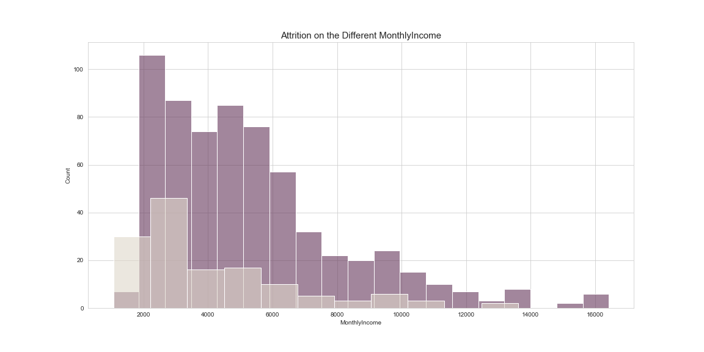

- DistanceFromHome & Attrition = No clear relationship between these columns

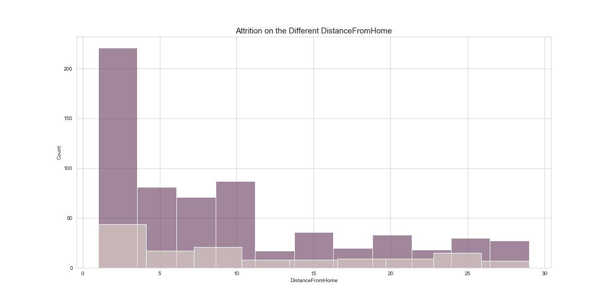

- PercentSalaryHike & Attrition = The lower percent of salary hike tends toward an attrition

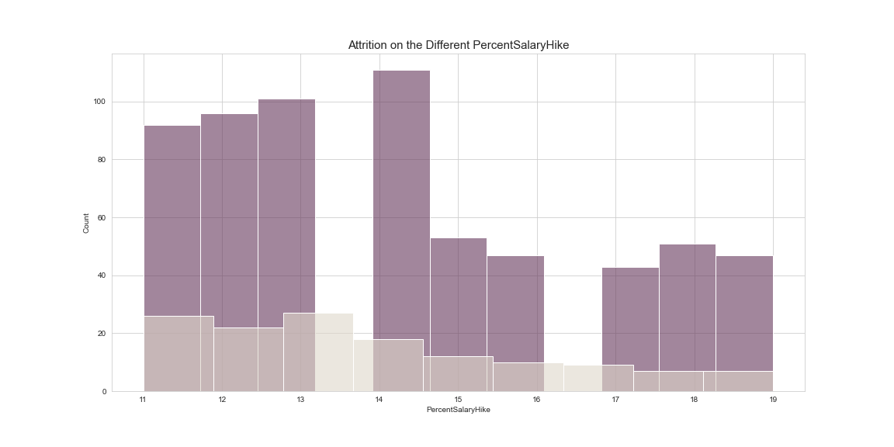

- YearsAtCompany & Attrition = The lower years at company tends toward an attrition

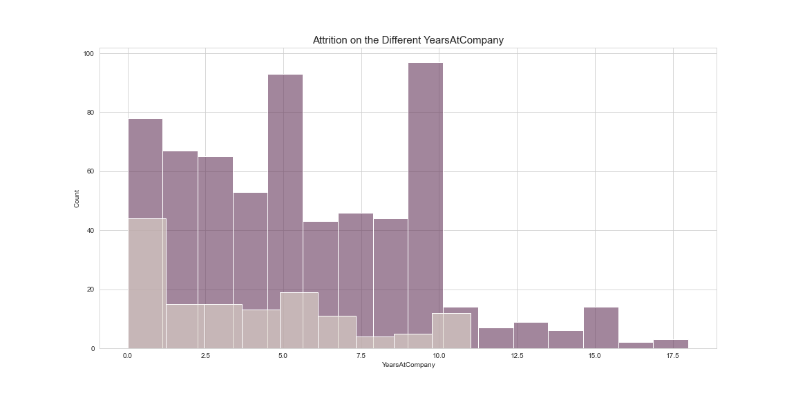

- YearsSinceLastPromotion & Attrition = The lower years since last promotion tends toward an attrition

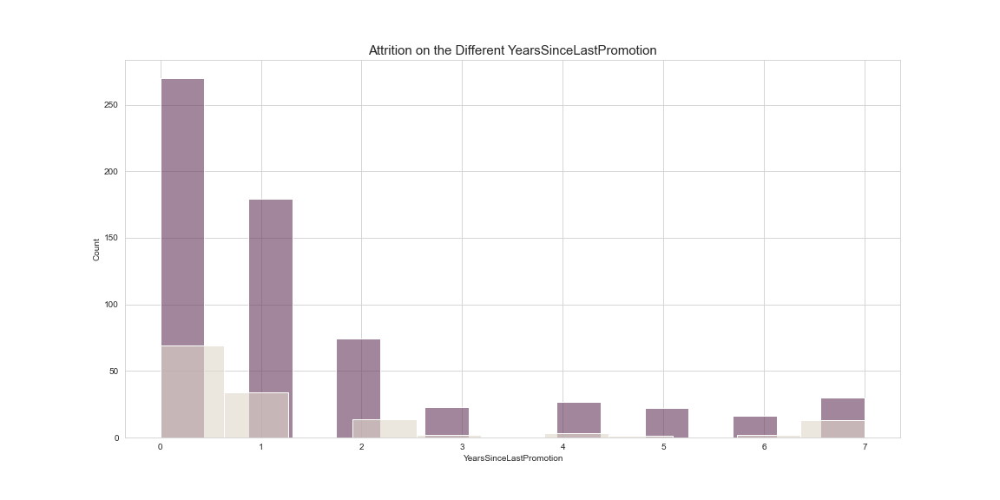

- WorkLifeBalance & Attrition = The lower WorkLifeBalance number tends toward an attrition

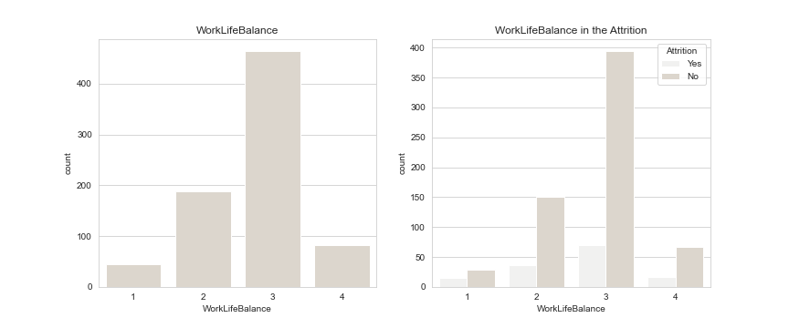

- EnvironmentSatisfaction & Attrition = The lower EnvironmentSatisfaction tends toward an attrition

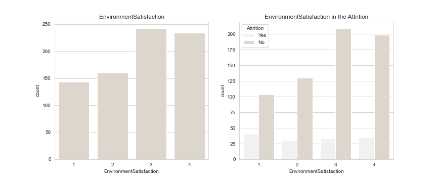

- JobRole & Attrition = Any jobrole related to "Sales" tends toward an attrition

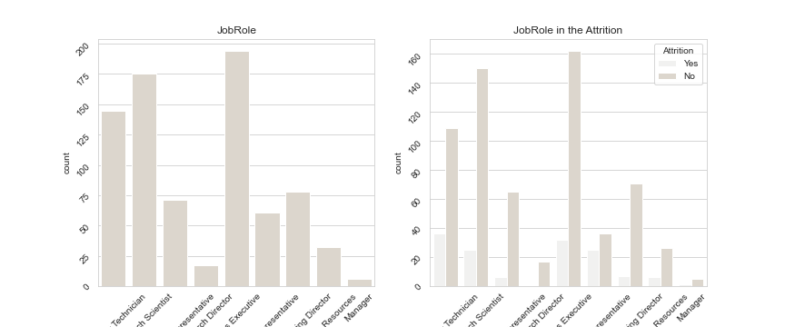

- OverTime & Attrition = The one who feels overtime in their work tends toward an attrition

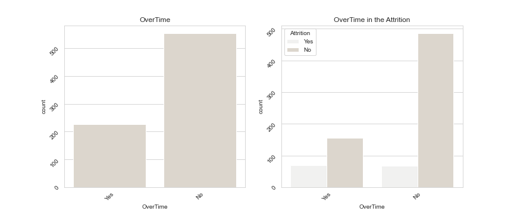

These insights above could be recommendations of programs or treatments to lower the number of employee attrition problems. From the insights, the improvements or changes could be made on the company itself & the employee. The improvements we could make on the company itself such as, programs to improve work life balance & working environment. Then the changes we could make on the employees are related to the employee recruitment process. In order to decrease the employee attrition problem, we could include criteria such as "we need the experienced person in the field", "we need the one who could work under pressure" (because the number of overtime is high) However, what are the most important features/predictors for the problem, so we could make a program priority list? Let's find top 5 of predictors!

---

### Model
- Baseline Model = Logistic Regression
- Proposed Models = SVC, DecisionTreeClassifier, AdaBoostClassifier, RandomForestClassifier, ExtraTreesClassifier, GradientBoostingClassifier
- Benchmark parameter = AUC
- AUC of baseline & proposed models

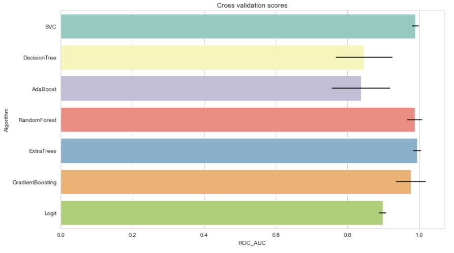

From the graph show AUC of each proposed model, proceeds to use a RandomForestClassifier for the final model.
- Hyperparameter Tuning = RandomForestClassifier
- Final Model AUC = 0.74

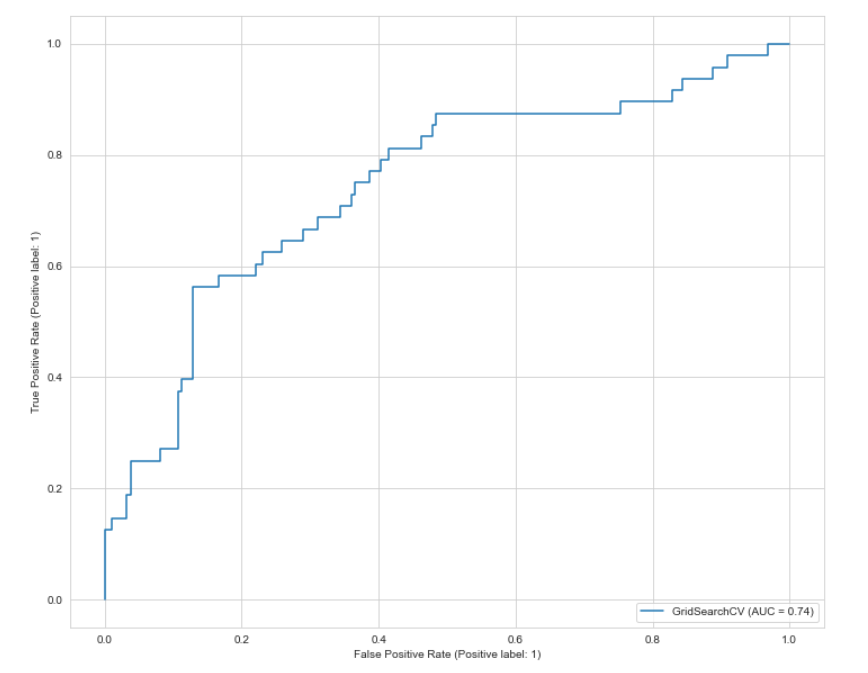

---

### Feature Importance
Top 5 feature importances =

1. MontlyIncome
2. Age
3. TotalWorkingYears
4. DailyRate
5. HourlyRate

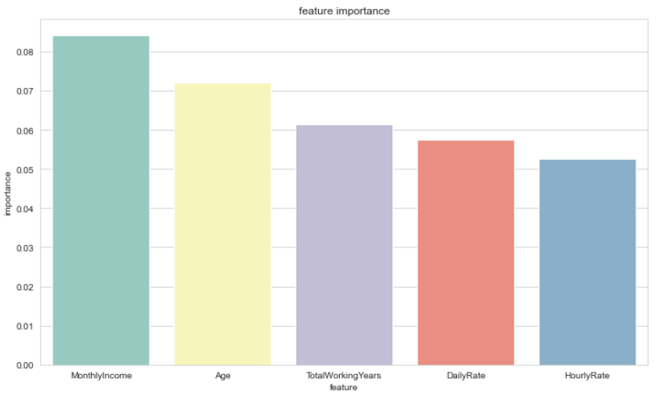

---

### Recommendation
I read & found some interesting articles[1], [2]. They show that the employee attrition problems are unique problems, and then they need unique approaches to address them. The problems in one company could be different with others. To address the employee attrition problem looking from the top 5 feature importances in the model, the company should =

- Pay attention to the employee rewards (Show by the MonthlyIncome, DailyRate, HourlyRate). At least the rewards are competitive enough with other company (competitor).
- Take care of the youngster (Show by the Age, TotalWorkingYears). The company should make sure that the environment, responsibilities, and challenges are proper for the youngster. A mentorship program could be applied.
- Consider to recruit more experienced employees (Show by the Age, TotalWorkingYears) instead of the youngster.
